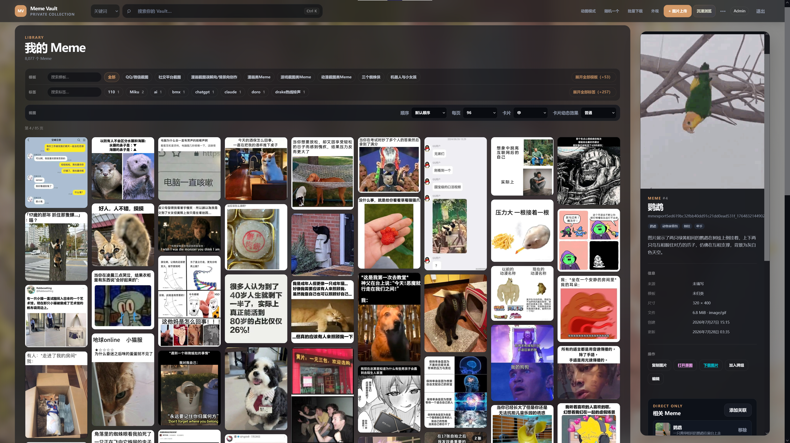
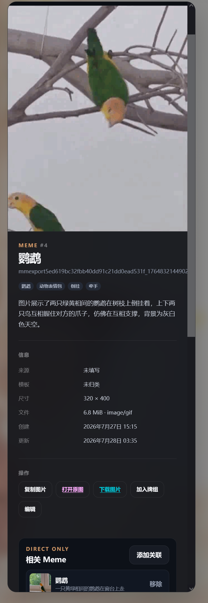
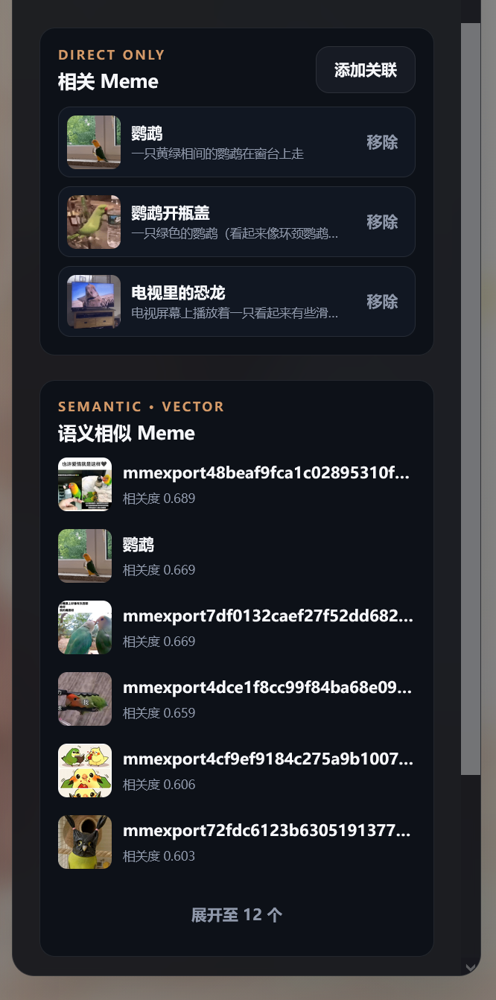
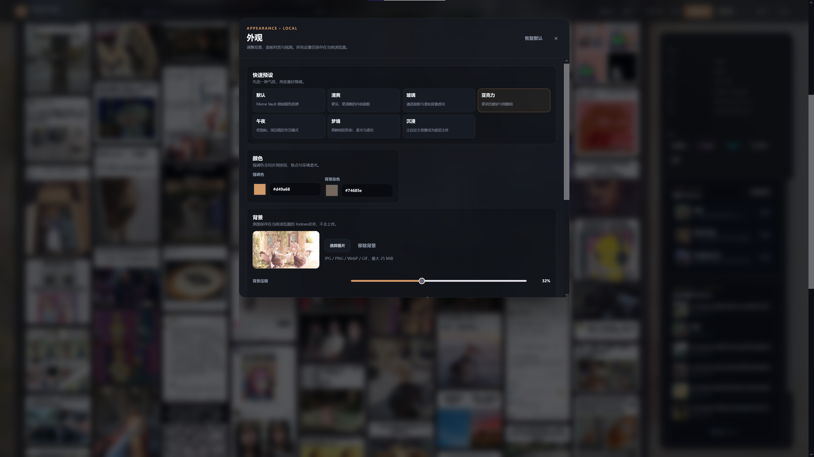
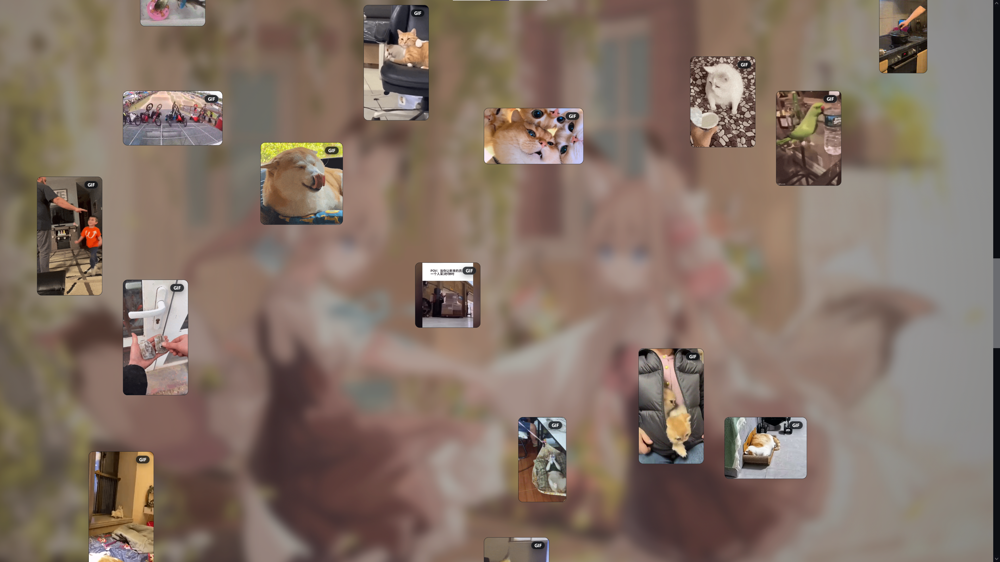

# Meme Vault

> 一个为私人 Meme 收藏打造的本地优先智能管理与沉浸浏览空间。
>
> A local-first personal Meme library for semantic search, visual organization, and immersive browsing.



**Collect, search, organize and wander through your personal Meme Vault.**

收藏、搜索、整理，也可以只是漫游其中。

Meme Vault 解决的是一个很朴素的问题：当 Meme 收藏不断增长，传统文件夹会越来越难以检索、归类和重新发现。它把图片与 GIF 管理、Tag（标签）、Template（模板）、Keyword Search（关键词搜索）、Semantic Search（语义搜索）和 Immersive Vault（沉浸式宝库）放进同一个本地空间；需要时，也可以通过 Access Gate（访问门禁）临时分享给朋友。

`Local-first（本地优先）` · `Semantic Search（语义搜索）` · `Immersive Browsing（沉浸浏览）` · `Visitor / Admin（访客 / 管理员）` · `Read-only External API（只读外部 API）`

**Current release / 当前版本：v2.0 — Multi-Vault（含 Vault Profile 与 Per-Vault Appearance）**

## Screenshots / 界面截图

| Inspector / 详情检查器 | Semantic Similar Meme / 语义相似 Meme |
| --- | --- |
|  |  |

### Appearance / 外观设置



## Multi-Vault / 多仓库

v2.0 起，一个 Meme Vault 实例可以管理多个相互独立的 Vault（仓库）：

```text
MemeVault
→ Vault 管理
    → Meme（默认仓库，承载 v2.0 之前的全部数据）
    → Anime
    → Life
    → ...
```

- 每个仓库的图片、搜索结果、向量索引、标签统计与随机浏览完全隔离。
- 单图上传上限默认 100MB，可在新建/编辑仓库时按仓库调整“单图大小上限（MB）”（1–1024）。
- 同一图片允许同时存在于不同仓库；重复检测只在其所属仓库内生效。
- 每个仓库有一个 Profile（meme / anime / photo / game_score / generic）：决定界面文案、可用功能（Capability）与扩展元数据。Anime 仓库支持作品/角色/画师/来源/收藏度/方向的详情编辑，以及收藏与横竖图筛选。
- 每个仓库拥有独立的外观主题（强调色、背景、模糊、面板材质、氛围），保存到服务器并随仓库切换；上传的背景图按仓库持久化，换设备也不丢。
- 顶栏 Vault Selector（仓库切换器）切换仓库；当前仓库反映在 URL `/v/{slug}` 中，刷新、收藏与前进后退均可恢复。
- 新仓库的图片保存在 `data/vaults/{slug}/` 独立目录；默认 meme 仓库继续使用原 `data/images/`，升级不移动任何既有文件。
- Vault 管理 API：`GET/POST /api/vaults`、`GET/PATCH/DELETE /api/vaults/{id}`；非空仓库删除必须显式 `force=true`，默认 meme 仓库不可删除。
- Vault 作用域资产端点：`/api/vaults/{id}/memes...`、`/api/vaults/{id}/tags`、`/api/vaults/{id}/semantic-search` 与 `/media/vaults/{slug}/...`。
- 旧 `/api/memes/*` 外部接口保持兼容，默认绑定 meme 仓库，Maibot 等既有消费者无需修改。

## Features / 核心能力

### Library Management / 资料库管理

- Meme、Tag（标签）与 Template（模板）的增删改查和组合筛选。
- Pagination（分页）、Batch Upload（批量上传）、多图 Meme、原图 / GIF 浏览与单图下载。
- Inspector（详情检查器）、批量 ZIP 导入导出、Collection / Deck（收藏集 / 牌组）与重复内容巡检。

### Search & Discovery / 搜索与重新发现

- Keyword Search（关键词搜索）与 Multimodal Semantic Search（多模态语义搜索）。
- Similar Meme（相似 Meme）、Random Exploration（随机探索）和基于上下文的 Meme 推荐。
- 向量索引状态、批量 Embedding Job（嵌入任务）和过期数据重建管理。

### Personal Experience / 私人化体验

- Theme Preset（主题预设）、Custom Background（自定义背景）以及 Glass / Acrylic（玻璃 / 亚克力）面板材质。
- Blur / Tint / Saturation（模糊 / 染色 / 饱和度）独立调节；背景原图保存在浏览器 IndexedDB（浏览器本地数据库），不会上传到服务端。
- Visitor / Admin Access Gate（访客 / 管理员访问门禁）、HttpOnly Session（仅 HTTP 会话 Cookie）和私有媒体认证保护。

## Immersive Vault / 沉浸式宝库

普通 Library（资料库）用于管理自己的 Vault；Immersive Vault（沉浸式宝库）让你直接进入自己的收藏。



- Occupancy Grid（占位网格）把不同尺寸的卡片排布成自由画廊。
- Infinite Feed（无限信息流）持续加载，同时处理翻页请求取消、重试和竞态状态。
- Original / GIF Media（原图 / GIF 媒体）按需加载，并支持 Focus Viewer（焦点查看器）。
- Random Navigation（随机漫游）、Free Gallery Tuner（自由画廊调参器）与 Card Physics（卡片物理效果）提供更松弛的浏览方式。

## Semantic Search / 语义搜索

Meme Vault 使用可配置的 Multimodal Embedding Provider（多模态嵌入提供方）把图片与文本转成 1024 维向量。归一化后的 `Float32 Vector（32 位浮点向量）` 以二进制形式保存在 SQLite，查询时由 NumPy 在本地完成相似度排序：

```text
Multimodal Embedding（多模态嵌入）
                │
                ▼
Float32 Vector（32 位浮点向量）
                │
                ▼
SQLite Vector Storage（SQLite 向量存储）
                │
                ▼
NumPy Similarity Search（NumPy 相似度检索）
```

当 Meme 的图片、文本、Tag（标签）或 Template（模板）发生变化时，`Derived Data Invalidation（派生数据失效）` 会在同一事务内把相关语义记录标记为 `stale（过期）`，并递增索引 `generation（代次）`，避免继续复用已经失效的内存索引。

## Architecture / 架构

```text
Frontend（前端）
      │
      ▼
FastAPI（后端接口）
      │
      ├── Meme / Tag / Template Services（业务服务）
      ├── Semantic Search（语义搜索）
      │      ├── Embedding Provider（嵌入提供方）
      │      ├── SQLite Vector Storage（SQLite 向量存储）
      │      └── NumPy Similarity（NumPy 相似度计算）
      ├── Auth: Visitor / Admin（认证：访客 / 管理员）
      └── Read-only External API（只读外部 API）
                    │
                    ▼
              Trusted Clients（可信客户端，例如 Maibot）
```

## Tech Stack / 技术栈

| Area / 分层 | Technologies / 技术 |
| --- | --- |
| Backend / 后端 | Python 3.11+、FastAPI、SQLAlchemy、SQLite、NumPy、Pillow、Pytest |
| Frontend / 前端 | TypeScript、Vite、Vanilla Web（原生 Web）、Vitest、IndexedDB |
| AI / 人工智能 | OpenAI-compatible Provider（兼容 OpenAI 协议的提供方）、Multimodal Embedding（多模态嵌入） |
| Access / 访问 | Access Key（访问密钥）、HttpOnly Session（仅 HTTP 会话 Cookie）、Visitor / Admin（访客 / 管理员） |
| Sharing / 分享 | Cloudflare Quick Tunnel（Cloudflare 临时隧道，可选） |

## Quick Start / 快速开始

### Requirements / 环境要求

- Python 3.11 或更高版本
- Node.js 20.19 或更高版本
- Git

### 1. Clone & Create Environment / 克隆并创建环境

```powershell
git clone https://github.com/Aomckin/Summer_Doge_With-Meme.git
cd Summer_Doge_With-Meme
python -m venv .venv
.\.venv\Scripts\Activate.ps1
python -m pip install -r requirements.txt
```

macOS / Linux 的激活命令为：

```bash
source .venv/bin/activate
```

### 2. Configure Secrets / 配置密钥

```powershell
Copy-Item .env.example .env
```

在 `.env` 中填写本地配置；不要把真实 Access Key（访问密钥）、Session Secret（会话密钥）或 AI Provider Key（AI 提供方密钥）提交到 Git。

### 3. Build & Run / 构建并启动

```powershell
npm.cmd --prefix frontend install
npm.cmd --prefix frontend run build
python -m uvicorn app.main:app --env-file .env --host 127.0.0.1 --port 8002
```

打开 <http://127.0.0.1:8002/>。Production Build（生产构建）会先执行 TypeScript Typecheck（TypeScript 类型检查），再由 Vite 生成 `frontend/dist/`；FastAPI 会在根路径托管构建后的前端。

已有环境和前端构建时，也可以一键启动后端：

```powershell
.\run-meme-vault.ps1
```

前端开发时，可以分别启动后端和 Vite Dev Server（Vite 开发服务器）：

```powershell
python -m uvicorn app.main:app --env-file .env --reload --host 127.0.0.1 --port 8002
npm.cmd --prefix frontend run dev
```

开发页面默认位于 <http://127.0.0.1:5173/>，`/api` 与 `/media` 会代理到本地后端。

## Configuration / 配置

`.env.example` 是可提交的配置模板；`.env` 存放真实本地 Secret（密钥），已经被 Git 忽略。Web 门禁启用时，Visitor、Admin 与 Session 三项必须同时配置。External API Key 独立配置，且三把 Access Key 必须互不相同。

```dotenv
VISITOR_ACCESS_KEY=
ADMIN_ACCESS_KEY=
SESSION_SECRET=
EXTERNAL_API_KEY=
MEME_VAULT_ENV=development

DATABASE_URL=sqlite:///data/meme_vault.db

OPENAI_API_KEY=
OPENAI_MODEL=gpt-5.6-luna
OPENAI_BASE_URL=https://api.openai.com/v1
AI_TIMEOUT_SECONDS=30
AI_SETTINGS_ENCRYPTION_KEY=
```

- `MEME_VAULT_ENV=development`：适合本机开发；未配置门禁三项时保持无认证兼容模式。
- `MEME_VAULT_ENV=production`：缺少门禁配置会 Fail Fast（快速失败），Session Cookie（会话 Cookie）会启用 `Secure`。
- `EXTERNAL_API_KEY`：Random、Semantic 与 External Media 的只读 Bearer Key；未配置时这些机器端点统一返回 `401`，不会回退到 Web Session。
- `DATABASE_URL`：可选；默认使用 `data/meme_vault.db`。
- AI Provider（AI 提供方）也可以在 Admin（管理员）界面配置并加密保存；环境变量是兼容回退方式。

## Visitor / Admin Access / 访客与管理员访问

```text
Unauthenticated（未认证） ──► Access Gate（访问门禁）
Visitor（访客）           ──► Read-only（只读）
Admin（管理员）           ──► Full Management（完整管理）
```

| Role / 角色 | Typical permissions / 典型权限 |
| --- | --- |
| Visitor / 访客 | 浏览、关键词与语义搜索、沉浸浏览、随机浏览、单图下载 |
| Admin / 管理员 | Visitor 的全部能力，以及上传、编辑、删除、批量导入导出、ZIP、AI / 索引 / 管理设置 |

浏览器认证使用进程内 HttpOnly Session（仅 HTTP 会话）。私有原图、缩略图和模板媒体也在同一认证边界内。完整路由矩阵见 [Permission Audit / 权限审计](docs/PHASE3_PERMISSION_AUDIT.md)。

## Temporary Friend Sharing / 临时好友分享

Cloudflare Quick Tunnel（Cloudflare 临时隧道）适合临时测试或私人分享，不是长期 Production Deployment（生产部署）方案。

```powershell
cloudflared tunnel --url http://127.0.0.1:8002
```

也可以在后端已经运行时一键启动临时通道：

```powershell
.\run-cloudflare-tunnel.ps1
```

```text
Temporary trycloudflare URL（临时网址）
                    │
                    ▼
Share URL + Visitor Key（分享网址与访客密钥）
                    │
                    ▼
Stop cloudflared（关闭后入口失效）
```

公网临时访问的媒体加载速度受部署主机上行带宽和网络链路影响，大图及 GIF 首次加载可能较慢。更完整的边界和检查项见 [Public Deployment Audit / 公网部署审计](docs/PHASE4_PUBLIC_DEPLOYMENT_AUDIT.md)。

## External API / 外部 API

Meme Vault 提供 Read-only External API（只读外部 API），可信客户端可获取随机 Meme，或通过自然语言进行语义检索；这为 Maibot 等外部客户端提供了集成入口。

External API 始终使用独立的 `Authorization: Bearer <EXTERNAL_API_KEY>` 机器认证，不接受 Visitor/Admin Session Cookie，也禁止复用 Visitor/Admin Key。该凭据只开放 Random、Semantic 与响应中的 External Media；Upload、Edit、Delete、Batch/ZIP 和 Settings 仍不可用。端点、参数与错误语义见 [External API Documentation / 外部 API 文档](docs/external-api.md)。

## Testing / 测试

后端与前端测试、类型检查和生产构建均可独立运行：

```powershell
python -m pytest -v
npm.cmd --prefix frontend test
npm.cmd --prefix frontend run typecheck
npm.cmd --prefix frontend run build
```

测试覆盖 API、Repository / Service（仓储 / 服务）边界、事务清理、语义索引失效、权限矩阵、Immersive Infinite Feed（沉浸式无限信息流）以及前端交互状态。

## Data & Privacy / 数据与隐私

- Meme Vault is local-first：数据库、原图和缩略图保留在运行服务的机器上。
- SQLite 数据库、本地媒体、导入导出归档、`.env` 和本地 AI 密钥文件都已被 `.gitignore` 排除。
- Web 私有媒体 URL 受 Visitor / Admin Session（访客 / 管理员会话）保护；External Media 入口单独校验机器 Bearer Key。
- 建议定期备份整个 `data/（本地数据目录）`，尤其是数据库与媒体文件。
- 仓库只跟踪 `data/images/.gitkeep` 与 `data/thumbnails/.gitkeep`，不包含用户的私人 Meme 数据库或媒体收藏。

## Project Structure / 项目结构

```text
app/                 后端应用：API、模型、仓储与业务服务（含 Multi-Vault）
frontend/            前端应用：TypeScript、Vite 与 Vitest
data/                本地数据：SQLite、原图、缩略图与任务产物（默认不跟踪）
docs/                项目文档：API、权限与部署审计
docs/images/         README 静态展示图
tests/               Pytest 后端自动化测试
scripts/             离线整理与维护脚本
```

## Known Limitations / 已知限制

- Quick Tunnel（临时隧道）的媒体速度取决于宿主机上行带宽与公网链路。
- Session Store（会话存储）位于当前 FastAPI 进程内；服务重启后需要重新登录。
- Semantic Search（语义搜索）需要先配置可用的 Multimodal Embedding Provider（多模态嵌入提供方）并建立 Ready Embedding（就绪向量）。

## Documentation / 文档

- [External API Documentation / 外部 API 文档](docs/external-api.md)
- [Permission Audit / 权限审计](docs/PHASE3_PERMISSION_AUDIT.md)
- [Public Deployment Audit / 公网部署审计](docs/PHASE4_PUBLIC_DEPLOYMENT_AUDIT.md)
- [Luna Tagging Workflow / Luna 标签整理工作流](docs/LUNA_TAGGING_WORKFLOW.md)

## License / 许可证

当前仓库尚未指定开源 License（许可证）。在明确选择许可证之前，默认保留全部权利；请勿把“可查看源码”理解为已获得复制、修改或再分发授权。
